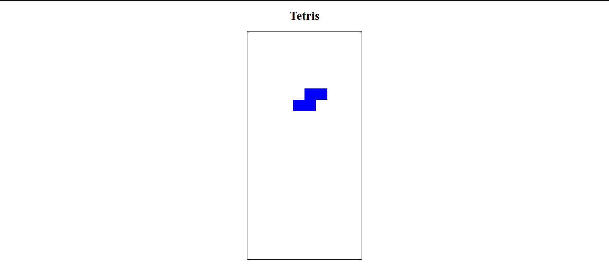

---

**Django Tetris** — это классическая игра Tetris, реализованная с использованием Django для бэкенда и JavaScript для фронтенда. Игра работает прямо в вашем браузере и позволяет насладиться классическим тетрисом с простым управлением.

## Особенности

- 🎮 **Классический геймплей**: Все фигуры и механики из оригинального тетриса.
- 🖥️ **Веб-интерфейс**: Игра работает в браузере, не требует установки дополнительного ПО.
- 🎨 **Простой и чистый дизайн**: Минималистичный интерфейс с фокусом на игре.
- ⚙️ **Управление**: Используйте стрелки на клавиатуре для управления фигурами.

## Как запустить проект

### Требования

- Python 3.8+
- Django 4.0+
- Браузер с поддержкой JavaScript

### Установка

1. Клонируйте репозиторий:

   ```bash
   git clone https://github.com/your_username/django-tetris.git
   cd django-tetris
   ```

2. Создайте виртуальное окружение и установите зависимости:

   ```bash
   python -m venv venv
   source venv/bin/activate  # Для Linux/MacOS
   # или
   venv\Scripts\activate     # Для Windows

   pip install -r requirements.txt
   ```

3. Примените миграции:

   ```bash
   python manage.py migrate
   ```

4. Запустите сервер разработки:

   ```bash
   python manage.py runserver
   ```

5. Откройте браузер и перейдите по адресу:

   ```
   http://127.0.0.1:8000/
   ```

### Управление в игре

- **Стрелка влево**: Движение фигуры влево.
- **Стрелка вправо**: Движение фигуры вправо.
- **Стрелка вниз**: Ускоренное падение фигуры.
- **Стрелка вверх**: Поворот фигуры.

## Скриншот

[](https://i.imgur.com/your_screenshot.png)

*Нажмите на изображение, чтобы увеличить.*

## Технологии

- **Backend**: Django
- **Frontend**: HTML5, CSS3, JavaScript
- **Игровой движок**: Canvas API


### Пример структуры проекта
```
django-tetris/
├── manage.py
├── tetris_project/
├── tetris/
│   ├── templates/
│   │   └── tetris/
│   │       └── tetris.html
│   └── static/
│       └── tetris/
│           └── tetris.js
├── static/
├── README.md
└── requirements.txt
```

---
