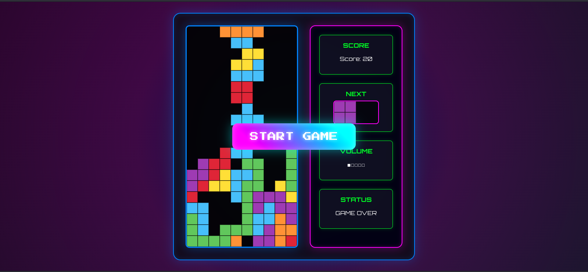
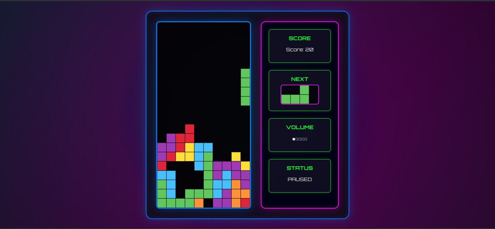

---

**Django Tetris** — **Современная веб-версия классического Тетриса** с неоновым дизайном и классической музыкой. Играй прямо в браузере!

## ✨ Особенности

- 🌌 **Неоновый ретро-стиль** с анимированными элементами
- 🎮 **Классический геймплей**: Все фигуры и механики из оригинального тетриса.
- 🖥️ **Веб-интерфейс**: Игра работает в браузере, не требует установки дополнительного ПО.
- ⚙️ **Управление**: Используйте стрелки на клавиатуре для управления фигурами.

## Как запустить проект

### Требования

- Python 3.8+
- Django 4.0+
- Браузер с поддержкой JavaScript

### Установка

1. Клонируйте репозиторий:

   ```bash
   git clone https://github.com/your_username/django-tetris.git
   cd django-tetris
   ```

2. Создайте виртуальное окружение и установите зависимости:

   ```bash
   python -m venv venv
   source venv/bin/activate  # Для Linux/MacOS
   # или
   venv\Scripts\activate     # Для Windows

   pip install -r requirements.txt
   ```

3. Примените миграции:

   ```bash
   python manage.py makemigrations
   python manage.py migrate
   ```

4. Запустите сервер разработки:

   ```bash
   python manage.py runserver
   ```

5. Откройте браузер и перейдите по адресу:

   [http://localhost:8000](http://localhost:8000)
   
   
## 🎮 Управление

| Клавиша       | Действие          |
|---------------|-------------------|
| ← →           | Движение вбок    |
| ↓             | Ускорение падения |
| ↑             | Поворот фигуры    |
| Пробел        | Пауза/Продолжить |
| +/-           | Громкость звука  |

## Скриншот






## Технологии

- **Backend**: Django
- **Frontend**: HTML5, CSS3, JavaScript
- **Игровой движок**: Canvas API


**Сделано с ❤️ и ностальгией по 90-м**  
[iNeltharion] · [an121@ymail.com]

---
